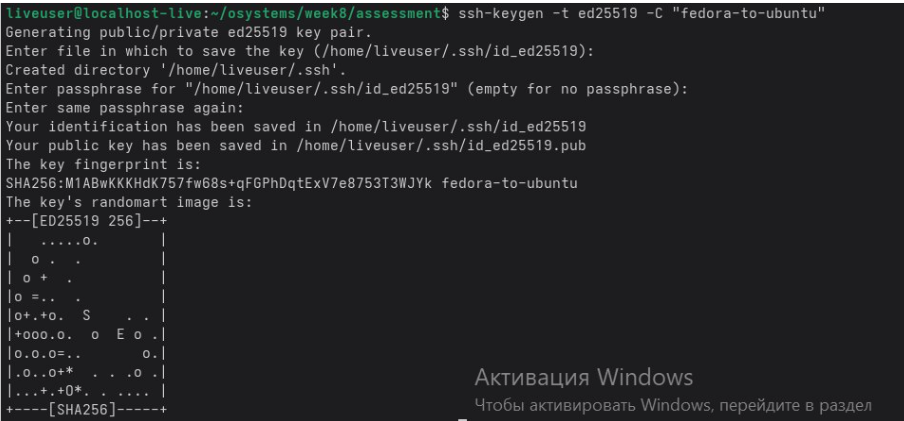
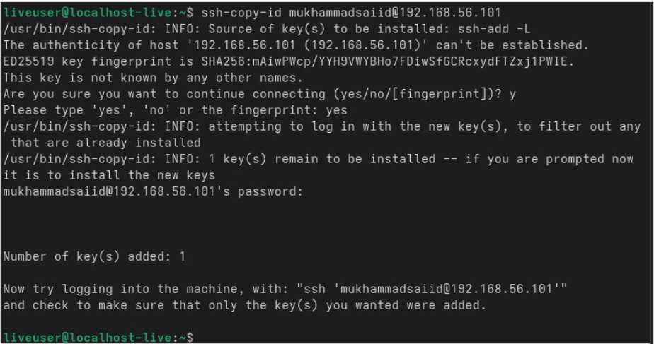
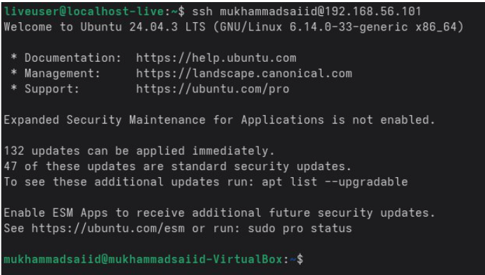
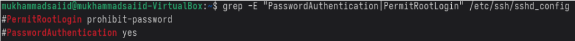
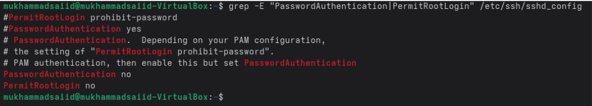
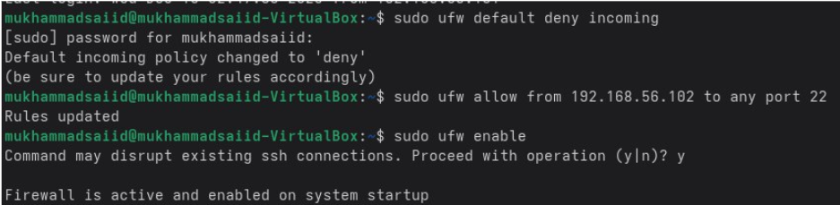
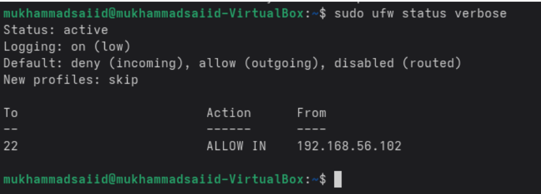
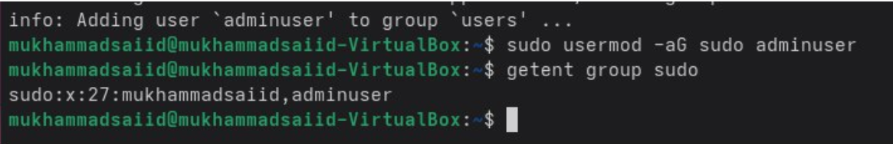
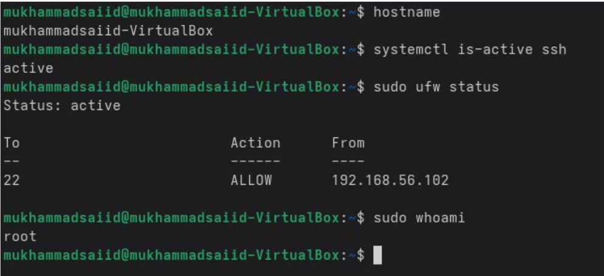

# **WEEK 4 – Initial System Configuration and Security Implementation**

[← Week 3](week3.md) | [Home](index.md) | [Next Week →](week5.md)

## **Phase 4 Overview**

This week focused on deploying the server and implementing foundational security controls. All configurations on the Ubuntu server were performed strictly through SSH from the Fedora workstation, following the administrative constraint in the assessment brief.

All deliverables for Week 4 were completed:

* SSH key-based authentication
* Firewall allowing SSH only from one workstation
* Privilege management and non-root administrative user
* SSH access verification
* Before/after configuration file comparison
* Full firewall ruleset documentation
* Remote administration evidence

---

# **4.1 SSH Key-Based Authentication Configuration**

## Objective

The goal was to eliminate password-based authentication and enable secure cryptography-based login using SSH keys. All SSH tasks were performed from the Fedora workstation.

---

## Step 1: Generating SSH Key Pair (Fedora Workstation)

A modern Ed25519 key pair was generated on the Fedora workstation using the ssh-keygen utility.
The key was saved in the ~/.ssh/id_ed25519 location with an optional passphrase for additional security.

  

---

## Step 2: Deploying the Public Key to the Ubuntu Server

The public key was copied to the Ubuntu server using the ssh-copy-id tool.
This appended the key into the ~/.ssh/authorized_keys file on the Ubuntu system, granting key-based login permissions.

  

---

## Step 3: Verifying Key-Based Authentication

A test SSH login was performed from Fedora to Ubuntu.
The connection succeeded without asking for a password, confirming that key-based authentication was working correctly.

  

---

## Step 4: Hardening SSH Configuration

The SSH configuration was edited on Ubuntu to disable insecure access methods:

* PasswordAuthentication set to no
* PermitRootLogin set to no
* PubkeyAuthentication ensured as yes

After applying the changes, the SSH service was restarted.

To document the modifications, the relevant lines were extracted using grep to show the before and after state of the configuration.

<strong>Before: Default SSH Configuration</strong>

  

<strong>After: Hardened SSH Configuration</strong>

  

---

# **4.2 Firewall Configuration – Restrict SSH Access to Fedora Only**

To ensure only the workstation could access the server, UFW on the Ubuntu server was configured to allow SSH exclusively from the Fedora workstation’s IP (192.168.56.102).
All commands were executed through SSH from Fedora.

  

Final firewall ruleset confirmed:

* All incoming connections denied by default
* SSH allowed only from 192.168.56.102
* UFW enabled and active

  

---

# **4.3 Creating a Non-Root Administrative User**

To avoid direct root usage, a new administrative user (adminuser) was created.
This user was added to the sudo group, allowing privilege-escalated commands when necessary.

Verification using getent showed that “adminuser” appeared correctly under the sudo group.

  

---

# **4.7 Remote Administration Evidence**

After applying all security controls, several administrative commands were executed via SSH from the Fedora workstation to verify remote management:

* hostname
* systemctl is-active ssh
* sudo ufw status
* sudo whoami

These commands confirm:

* Remote access remains functional
* SSH service is active
* Firewall is enforcing correct rules
* Administrative privileges work correctly through sudo

  

---

**Reflection**

This week focused on applying security controls in practice rather than just planning them. Configuring SSH key-based authentication and disabling password and root access highlighted how small configuration changes can significantly improve system security. Performing all actions remotely via SSH reinforced the importance of careful configuration, as mistakes could result in losing access to the server.

Restricting SSH access to a single workstation using firewall rules demonstrated how network-level controls add an additional layer of protection beyond authentication. Creating a non-root administrative user also emphasised the principle of least privilege and reduced reliance on the root account. Overall, this week improved my confidence in securely managing a remote Linux server and showed how multiple security mechanisms work together to protect the system.

---
[← Week 3](week3.md) | [Home](index.md) | [Next Week →](week5.md)
