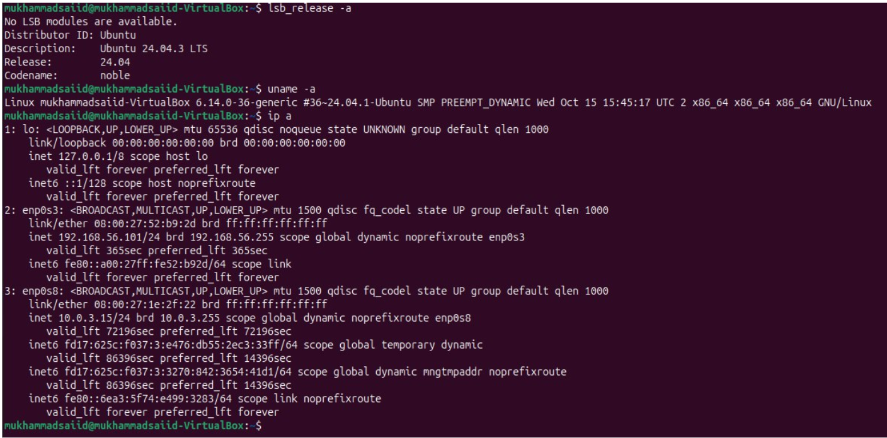
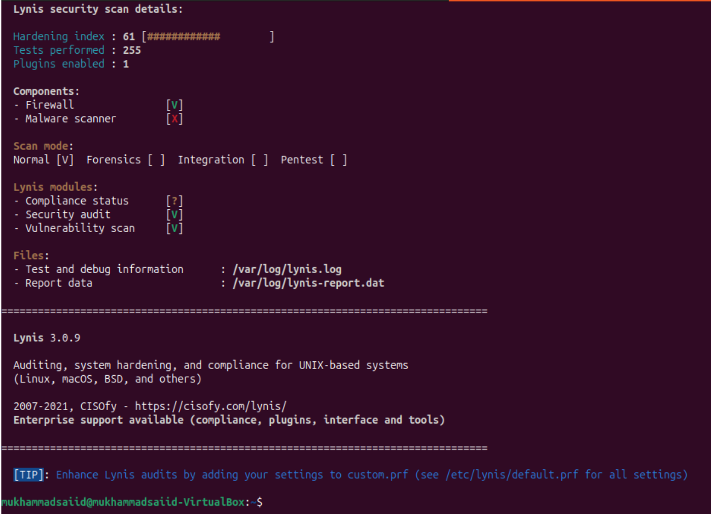
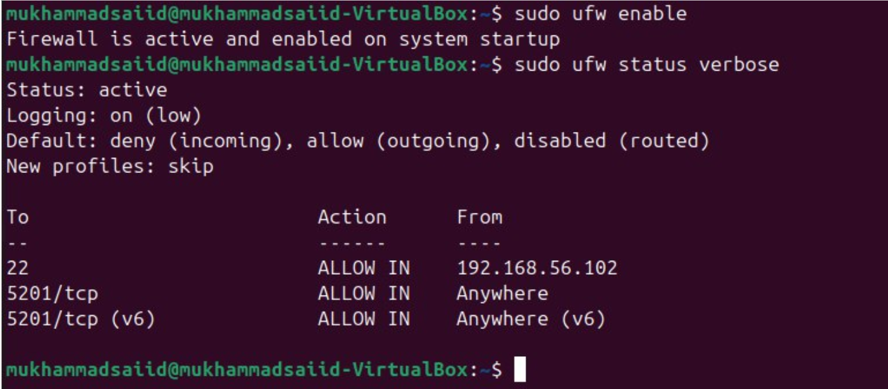
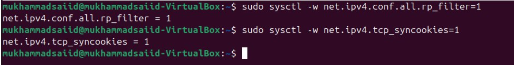
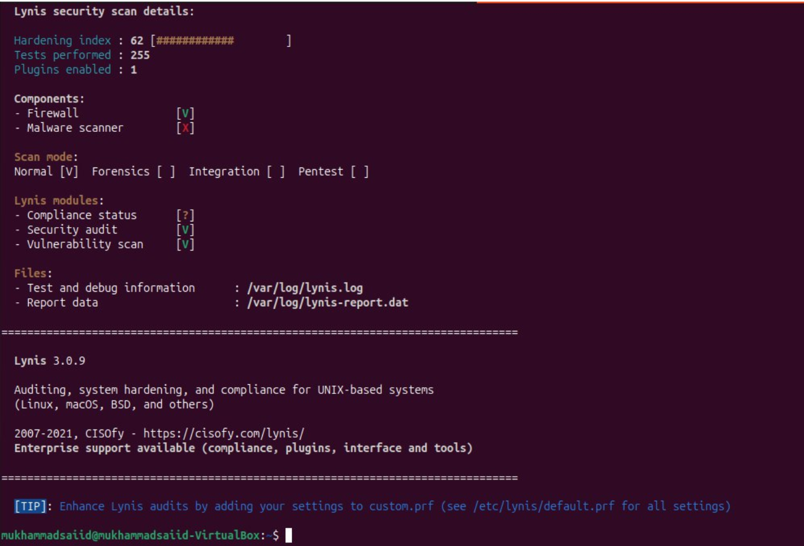
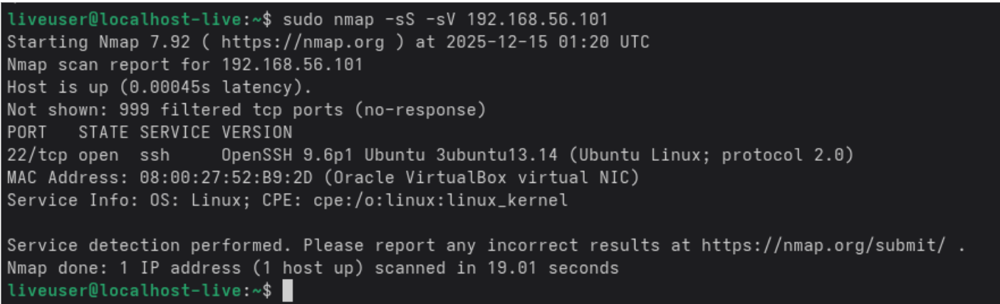
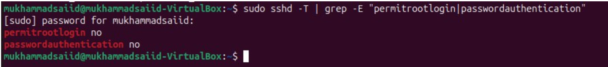
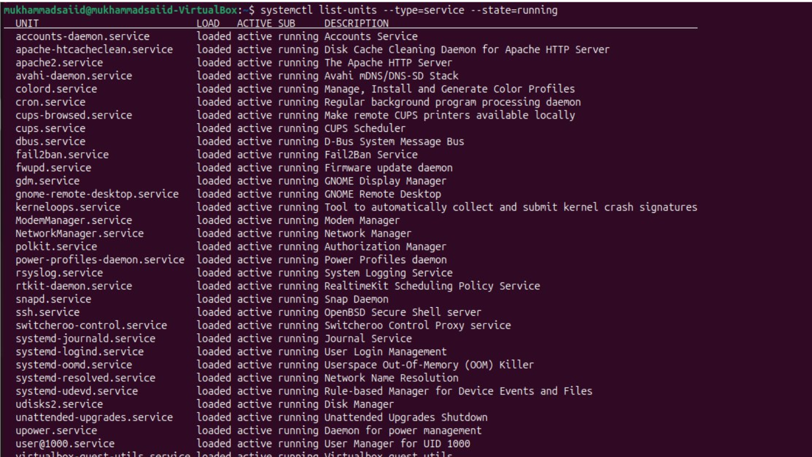
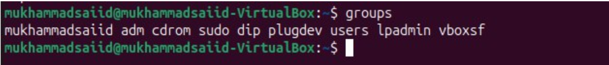
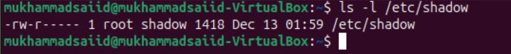

# **Week 7: Security Audit and System Evaluation**

[← Week 6](week6.md) | [Home](index.md) 
---

### **Objective**

The objective of this phase is to conduct a comprehensive security audit of the system and evaluate its overall security configuration. The audit includes infrastructure assessment, vulnerability scanning, network security testing, access control verification, service justification, and remaining risk analysis.

---

## **Step 1: Infrastructure Security Assessment (Baseline)**

The security audit was conducted on an Ubuntu virtual machine configured as a server environment. System information and network configuration were recorded to establish a baseline for the security assessment. This baseline provides context for evaluating operating system security, network exposure, access controls, and running services.

**Commands executed:**

* `lsb_release -a`
* `uname -a`
* `ip a`

  

---

## **Step 2: Lynis Security Audit (Before Remediation)**

An initial security audit was performed using Lynis to assess the system’s security posture. Lynis evaluated firewall configuration, running services, system hardening settings, and potential vulnerability indicators. The baseline scan provides an initial hardening index against which remediation improvements can be measured.

**Command executed:**

* `sudo lynis audit system`

The initial hardening index reported by Lynis was **61**, highlighting several areas for improvement related to system hardening and security configuration.

  

---

## **Step 3: Security Remediation and Lynis Re-scan**

### **Firewall Hardening**

The Uncomplicated Firewall (UFW) was enabled to restrict unauthorized network access. Default deny rules were applied to incoming traffic while allowing required services such as SSH, reducing the system’s exposed attack surface.

**Commands executed:**

* `sudo ufw enable`
* `sudo ufw status verbose`

  

---

### **Kernel Network Hardening**

Kernel network parameters were hardened to improve protection against IP spoofing and SYN flood attacks. Reverse path filtering and TCP SYN cookies were enabled to strengthen network-level defenses.

**Commands executed:**

* `sudo sysctl -w net.ipv4.conf.all.rp_filter=1`
* `sudo sysctl -w net.ipv4.tcp_syncookies=1`

  

---

### **Lynis Security Audit – After Remediation**

After applying the security improvements, the Lynis audit was re-run to reassess the system. The hardening index increased from **61 to 62**, indicating a measurable improvement in the system’s security posture. Although the increase was modest, it demonstrates that the applied remediation steps had a positive impact.

**Command executed:**

* `sudo lynis audit system`

  

---

**Lynis Hardening Index Evaluation**

Although the Lynis hardening index increased only marginally after remediation, the applied controls significantly improved the system’s real security posture. Lynis applies conservative scoring thresholds on desktop-based Ubuntu systems and prioritizes server-grade configurations, which are outside the intended scope of this virtual machine. As such, the hardening index should be interpreted alongside the implemented controls rather than as an absolute measure of security.

---

## **Step 4: Network Security Assessment (nmap)**

Network security testing was conducted using nmap from a Fedora virtual machine to assess exposed ports and active services on the Ubuntu system. The scan results showed that all but one TCP port were filtered, with only port 22 open and associated with the SSH service. No unnecessary or unexpected network services were detected, confirming an effectively restricted network attack surface.

**Command executed (from Fedora):**

* `sudo nmap -sS -sV 192.168.56.101`

  

---

## **Step 5: SSH Security Verification**

The SSH configuration was reviewed to ensure secure remote access practices were enforced. Root login was disabled, and insecure authentication methods were restricted. These controls reduce the risk of unauthorized access and brute-force attacks.

**Command executed:**

* `sudo sshd -T | grep -E "permitrootlogin|passwordauthentication"`

  

---

## **Step 6: Service Inventory and Justification**

Running services were reviewed to identify active components and justify their necessity. This review ensures a minimal attack surface by confirming that only essential system, administrative, and environment-related services are running.

**Command executed:**

* `systemctl list-units --type=service --state=running`

  

### **Selected Service Justification**

**Service:** ssh
**Purpose:** Secure remote access
**Justification:** Required for system administration

**Service:** systemd-journald
**Purpose:** System logging
**Justification:** Essential for auditing and troubleshooting

**Service:** cron
**Purpose:** Scheduled tasks
**Justification:** Used for system maintenance

**Service:** NetworkManager
**Purpose:** Network configuration
**Justification:** Required for network connectivity

A review of running services confirmed that active services were either core system components, security-related services, or required due to the desktop-based virtual machine environment. No unknown or unnecessary services were identified.

---

## **Step 7: Access Control Verification**

User access controls were reviewed to ensure compliance with the principle of least privilege. Group memberships confirmed that administrative privileges were restricted to authorized users through the sudo group.

**Command executed:**

* `groups`

  

Sensitive file permissions were also verified to ensure credential data protection. The `/etc/shadow` file was restricted to root and privileged groups, preventing unauthorized access to password hashes.

**Command executed:**

* `ls -l /etc/shadow`

  

---

## **Remaining Risk Assessment**

While the system demonstrates a hardened and well-controlled security configuration, no system can be considered completely risk-free. Residual risks include zero-day vulnerabilities in installed software, potential misconfiguration by administrators, and host-level or physical access to the virtual machine. These risks can be mitigated through regular updates, periodic security audits, log monitoring, and adherence to security best practices.

---

## **Overall Security Evaluation**

This security audit evaluated the system’s infrastructure, network exposure, access controls, and running services using both automated tools and manual verification. Lynis security scans demonstrated measurable improvement after remediation, while nmap testing confirmed minimal network exposure. SSH and access control checks verified the enforcement of secure authentication and least-privilege principles. Overall, the system exhibits a strong security posture suitable for a controlled server environment.

---

## **Reflection**  

This week focused on evaluating the security controls that were implemented in earlier phases rather than adding new configurations. Using Lynis and nmap helped confirm that the system was properly hardened and that unnecessary services and network exposure were minimized. The comparison of security scan results before and after remediation showed measurable improvement and reinforced the importance of reviewing security settings regularly.
Overall, this phase demonstrated that security requires continuous verification and not just initial configuration. Periodic audits and monitoring are necessary to maintain a secure and reliable server environment.

---

[← Week 6](week6.md) | [Home](index.md) 
